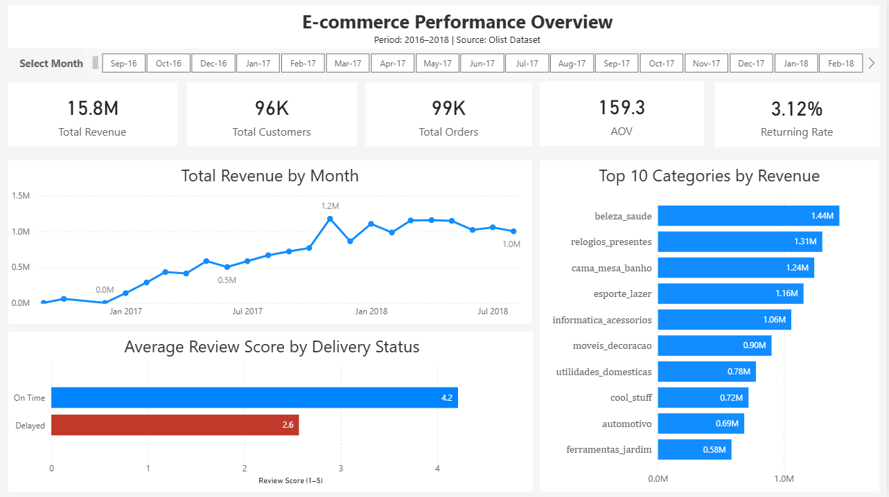

# 📊 E-commerce Performance Dashboard (SQL + Power BI)

## 🔍 Overview

This project analyzes a real-world e-commerce dataset (Olist) using SQL and Power BI.

The goal was to simulate a real data analyst workflow:

* prepare and transform data using SQL
* build an analytical dataset
* create an interactive dashboard for business insights

---

## 🎯 Objectives

* Analyze overall business performance
* Track revenue trends over time
* Evaluate customer behavior
* Identify top-performing product categories
* Understand how delivery impacts customer satisfaction

---

## 🛠 Tools & Technologies

* **PostgreSQL** — data preparation
* **SQL** — data transformation & aggregation
* **Power BI** — data visualization & dashboarding

---

## 🧱 Data Preparation (SQL)

Two analytical tables were created:

### 1. `analysis_table`

Main dataset used for KPIs and trend analysis:

* revenue (aggregated from order_items)
* payment_value
* review_score (average)
* delivery_status (On Time / Delayed)
* order_month

### 2. `category_analysis_table`

Used for category-level analysis:

* revenue by product category
* supports Top 10 categories visualization

The data was transformed using joins, aggregations, and CTEs to create a flat structure optimized for BI.

---

## 📈 Dashboard Features

* **KPI Cards**

  * Total Revenue
  * Total Orders
  * Total Customers
  * Average Order Value (AOV)

* **Revenue Trend**

  * Monthly revenue growth

* **Customer Satisfaction**

  * Comparison of review scores:

    * On Time vs Delayed deliveries

* **Top 10 Categories**

  * Revenue distribution by category

* **Interactive Slicer**

  * Filter data by month

* **Custom Tooltip**

  * Displays additional metrics on hover

---

## 💡 Key Insights

* Revenue shows steady growth with peaks in late 2017
* A small number of categories drive a large portion of revenue (Pareto effect)
* Delayed deliveries significantly reduce customer satisfaction
* Most customers make only one purchase (low retention)

---

## 📂 Project Structure

```
ecommerce-powerbi-dashboard/
├── ecommerce_dashboard.pbix
├── README.md
├── screenshots/
│   └── dashboard.png
└── sql/
    └── create_analysis_table.sql
```

---

## 🖼 Dashboard Preview



---

## 🚀 How to Use

1. Open `ecommerce_dashboard.pbix` in Power BI Desktop
2. Connect to your PostgreSQL database (or use imported data)
3. Interact with slicers and visuals

---

## 📬 Author

Andrii Shkelebei
Aspiring Data Analyst focused on SQL and Business Intelligence
