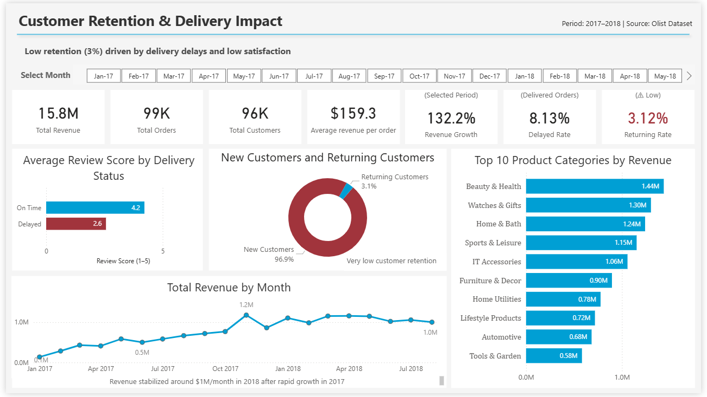

# E-commerce Customer Retention & Delivery Impact

## Problem

E-commerce businesses rely on repeat customers for long-term growth.  
This project investigates why customer retention is low and whether delivery performance affects customer satisfaction.

---

## Data

Dataset: Brazilian E-Commerce Public Dataset by Olist (Kaggle)
 Period: Jan 2017 – Aug 2018
 Size: ~100K orders, customers, payments, reviews

Data adjustments:
Removed early low-volume months
Excluded incomplete late months

---

## What I Did

Built analytical tables in SQL using JOINs, CTEs, and aggregations
Calculated key business metrics:
 Revenue & Monthly Growth %
 Average Order Value (AOV)
 Returning Customer Rate
 Delivery Delay Rate
 Review Score distribution
Segmented customers (new vs returning)
Analyzed delivery performance impact on customer satisfaction
Built an interactive Power BI dashboard for KPI monitoring

---

## Key Insights

 **Very low customer retention (~3%)**
   **Delayed deliveries ~8% of all orders**
   **Customer satisfaction strongly зависит from delivery:**
  - On-time: **4.2 avg rating**
  - Delayed: **2.6 avg rating**
   **Revenue growth:**
  - Rapid growth in 2017
  - Stabilized at ~$1M/month in 2018

**Key finding:**  
Delivery delays are strongly associated with lower customer satisfaction and likely contribute to low retention.

---

## Business Impact

- Low retention indicates a risk to long-term revenue stability
- Poor delivery performance negatively affects customer experience
- Improving logistics can directly increase customer satisfaction and repeat purchases

---

## Recommendations

Improve delivery time accuracy and logistics performance
Monitor delayed orders as a key KPI
Introduce retention strategies (loyalty programs, follow-up offers)
Focus on customer experience after delivery

---

## Dashboard



The dashboard includes:

- Revenue, Orders, Customers, AOV
- Revenue trend & growth %
- Returning customer rate
- Delivery delay rate
- Review score by delivery status
- Top product categories

---

## SQL Analysis

SQL scripts used for data preparation and analysis:

- `01_create_analysis_table.sql`  
  → built main analytical dataset

- `02_business_analysis_queries.sql`  
  → calculated business metrics:
  - Monthly revenue growth
  - Returning customer rate
  - Delivery delay rate
  - AOV
  - Category performance
  - Review analysis

---

## 🛠 Tools

- SQL (PostgreSQL)
- Power BI

---

## 📁 Project Structure
```
├── screenshots/
│ └── overview_dashboard.png
├── sql/
│ ├── 01_create_analysis_table.sql
│ ├── 02_business_analysis_queries.sql
│ └── README.md
├── customer_retention_analysis.pbix
├── README.md
├── LICENSE
└── .gitignore
```
---

## 👤 Author

**Andrii Shkelebei**
